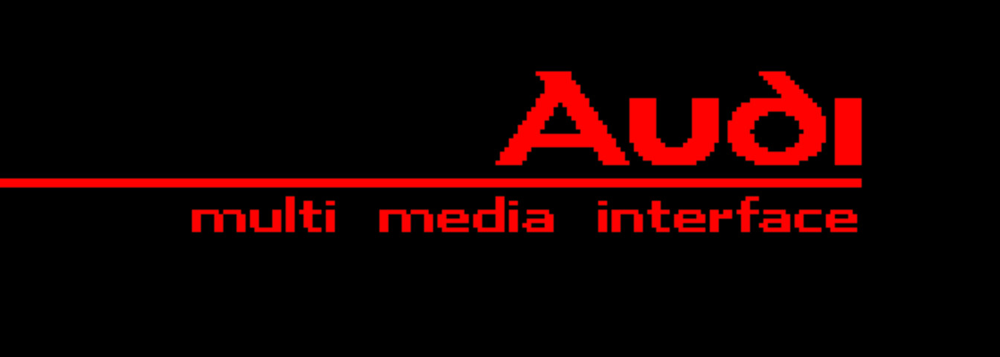
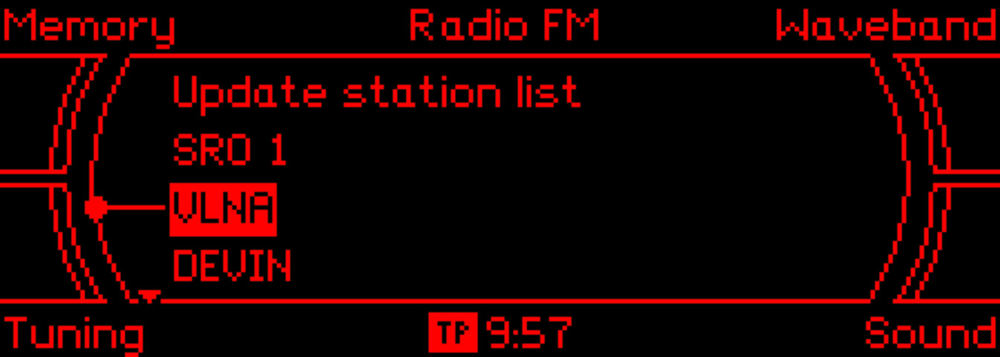

# MMI Basic Protocol — Monochrome Display (Audi A6 C6 / 4F)

This repository collects captures, parsers and partial decoders for the MMI
Basic monochrome display protocol used in some Audi A6 C6 (4F) vehicles. The
goals are to document the protocol, decode command structures and provide
tools to emulate or replace the OEM display for research and education.

## Overview

- Communication path: CAN (head unit) → CAN-to-UART converter (display) → LCD controller
- Observed display resolution: 224 × 80 px (see `example/src/Command04.ts` or `docs/commands/Command04.md`)

## What’s in this repository

- `CanFrame.kt` — CAN frame parsing and helpers
- `USBDevice.kt` — UART/CAN helper for logging and test harnesses
- `example/data.csv` — captured examples
- `example/loadScreen.csv` — author-generated load screen data (this screen is not produced by the MMI head unit; it is implemented directly in the display unit)
- `example/src/` — example parsers and command implementations (`Command04.ts`, `Command0A.ts`, `Command0D.ts`, `Command31.ts`, `Command39.ts`, `Command55.ts`)
- `docs/` — documentation (command reference, CAN frame, PLC, and per-command docs)
- `resources/` — images and screenshots used by the README and tests
- `scripts/` — helper scripts (data processing, conversion)
- `LICENSE` — project license

## Quick summary

- Protocol: CAN → CAN-to-UART → LCD controller (monochrome)
- Key commands (examples): `0x04`, `0x0A`, `0x0D`, `0x31`, `0x39`, `0x55` — see implementations in `example/src/` and per-command docs in `docs/commands/`.

## Debugging / Hardware

The capture setup uses a UART→USB converter to tap the CAN-to-UART output from
the display module. Converter settings and helper code live in `USBDevice.kt`.

## Documentation

- Command index: `docs/commands.md` (links to per-command files in `docs/commands/`)
- CAN framing and PLC notes: `docs/canframe.md`

## Contribution

Contributions are welcome. Good first tasks:

- Add decoding for unclear command fields
- Improve per-command documentation and examples
- Add a visualizer that renders frames to images for quick verification

Please open issues for questions or submit pull requests for code changes.

## License

See [LICENSE](LICENSE) for license terms.

---

Updated README — key files: `docs/` and `example/src/`.

